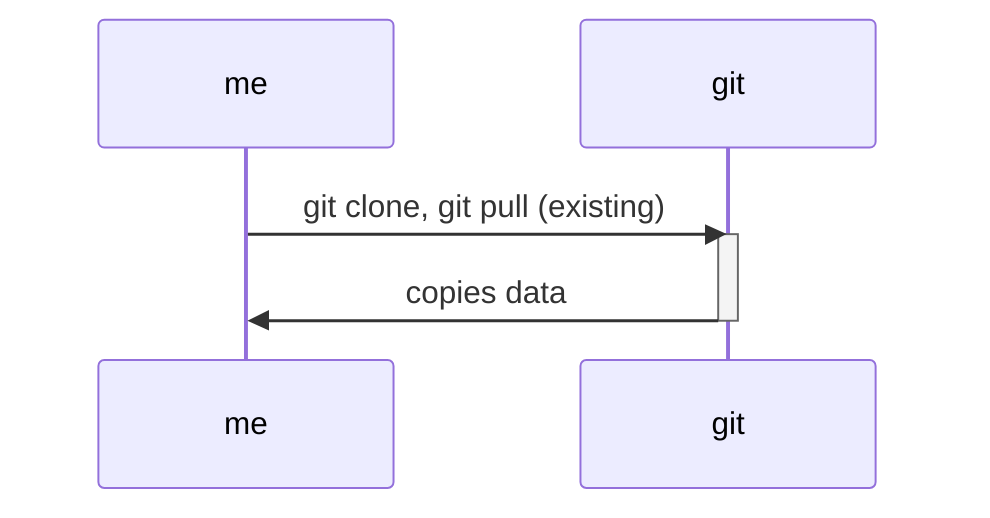

# mermaid for Sequential Diagrams

```mermaid
sequenceDiagram
    participant me
    participant git
  
    me->>git: git clone, git pull (existing)
    activate git
    git->>me: copies data
    deactivate git
```
