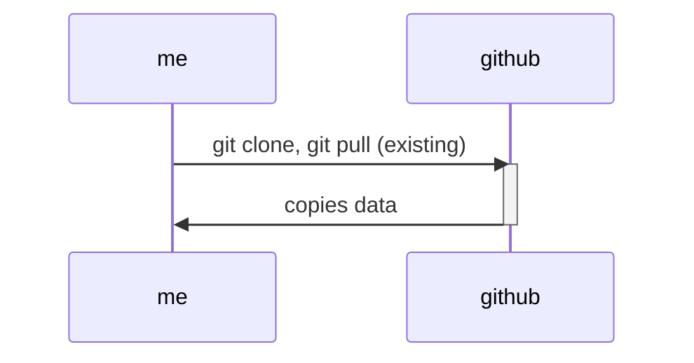

# testing

```mermaid
sequenceDiagram
    participant me
    participant github
  
    me->>github: git clone, git pull (existing)
    activate github
    github->>me: copies data
    deactivate github
```
