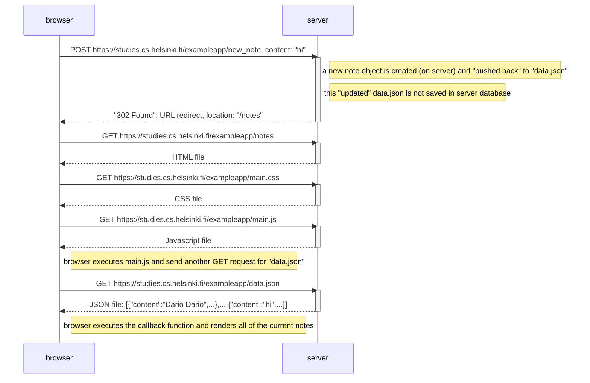

```mermaid
sequenceDiagram
    participant browser
    participant server

    browser->>server: POST https://studies.cs.helsinki.fi/exampleapp/new_note, content: "hi"
    activate server
    Note right of server: a new note object is created (on server) and "pushed back" to "data.json"
    Note right of server: this "updated" data.json is not saved in server database
    server-->>browser: "302 Found": URL redirect, location: "/notes"
    deactivate server

    browser->>server: GET https://studies.cs.helsinki.fi/exampleapp/notes
    activate server
    server-->>browser: HTML file
    deactivate server

    browser->>server: GET https://studies.cs.helsinki.fi/exampleapp/main.css
    activate server
    server-->>browser: CSS file
    deactivate server

    browser->>server: GET https://studies.cs.helsinki.fi/exampleapp/main.js
    activate server
    server-->>browser: Javascript file
    deactivate server

    Note right of browser: browser executes main.js and send another GET request for "data.json"
    browser->>server: GET https://studies.cs.helsinki.fi/exampleapp/data.json
    activate server
    server-->>browser: JSON file: [{"content":"Dario Dario",...},...,{"content":"hi",...}]
    deactivate server

    Note right of browser: browser executes the callback function and renders all of the current notes
```
