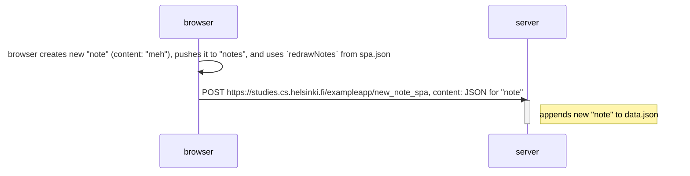

```mermaid
sequenceDiagram

    participant browser
    participant server

    browser->>browser: browser creates new "note" (content: "meh"), pushes it to "notes", and uses `redrawNotes` from spa.json
    browser->>server: POST https://studies.cs.helsinki.fi/exampleapp/new_note_spa, content: JSON for "note"
    activate server
    Note right of server: appends new "note" to data.json
    deactivate server
```
